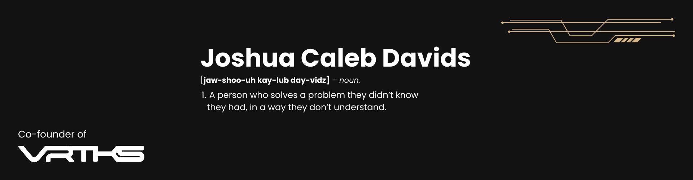

<p align="center">
  
</p>

<h1 align="center">Hey, I'm Joshua 👋</h1>

<p align="center">
  <strong>WordPress Developer · Frontend Builder · Backend Explorer</strong><br />
  Based in Cape Town, South Africa 🇿🇦
</p>

<p align="center">
  <a href="https://www.linkedin.com/in/joshuacalebdavids/"></a>
  <a href="mailto:joshuadavids.jcd@gmail.com"></a>
  <a href="https://codepen.io/joshuacalebdavids"></a>
</p>

---

### I build purposeful websites without the bloat.

I'm a WordPress developer with 5+ years of experience turning ideas into approachable, user-friendly web experiences. After years of working with page builders, I moved closer to the code—building custom themes and plugins that are lightweight, maintainable, and made for the people who actually use them.

My sweet spot is where thoughtful frontend work meets practical backend engineering. I enjoy taking a problem apart, finding the simplest path through it, and leaving behind code the next developer will be happy to open.

```php
<?php

$currently = [
    'building' => 'custom WordPress themes & plugins',
    'learning' => 'deeper backend development',
    'valuing'  => 'clean code, useful experiences & steady growth',
];
```

### What I bring to the build

| 🎨 Thoughtful frontend | ⚙️ Custom WordPress | 🧩 Problem solving |
| :--- | :--- | :--- |
| Responsive, intuitive interfaces built around real users. | Lean themes and plugins shaped to fit the project—not the other way around. | A calm, curious approach to debugging, collaboration, and learning. |

### Toolbox

**Core**


**Frontend & JavaScript**


**Tools & platforms**


### Explore my work

This profile is where I share what I'm building, learning, and refining. Have a look through my repositories—or reach out if something sparks an idea.

<p align="center">
  <a href="https://github.com/joshuacalebdavids?tab=repositories"></a>
</p>

---

<p align="center">
  Away from the keyboard, you'll find me running along the beach, hiking Cape Town's mountains, or training at the gym.
  <br /><br />
  <strong>Have an interesting project or idea?</strong> I'm always up for a good conversation.
  <br />
  <a href="mailto:joshuadavids.jcd@gmail.com">Let's talk →</a>
</p>

<p align="center">
  <a href="https://www.instagram.com/_onlycaleb/">Instagram</a> ·
  <a href="https://www.linkedin.com/in/joshuacalebdavids/">LinkedIn</a> ·
  <a href="https://codepen.io/joshuacalebdavids">CodePen</a>
</p>
