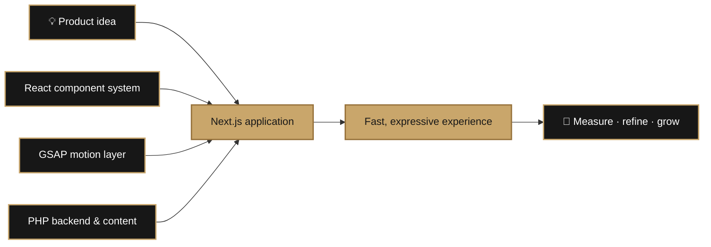

<p align="center">
  
</p>

<h1 align="center">Hey, I'm Joshua 👋</h1>

<p align="center">
  <strong>Next.js & React Developer · GSAP Motion · PHP Backend</strong><br />
  Based in Cape Town, South Africa 🇿🇦
</p>

<p align="center">
  
  
  
  
</p>

<p align="center">
  <a href="https://www.linkedin.com/in/joshuacalebdavids/"></a>
  <a href="mailto:joshuadavids.jcd@gmail.com"></a>
  <a href="https://codepen.io/joshuacalebdavids"></a>
</p>

---

### I build fast, expressive web experiences.

I'm a frontend-focused developer with 5+ years in web development, now building modern web experiences with **Next.js** and **React**. I care about interfaces that load quickly, feel intuitive, and have just enough personality to be memorable. With **GSAP**, I turn motion into part of the experience—not decoration added at the end.

My **PHP** and WordPress background gives me a practical backend foundation too. That combination lets me think beyond individual components and understand the full journey from content and data to the experience in the browser.

```js
const focus = {
  frontend: ["Next.js", "React"],
  motion: "GSAP",
  backend: "PHP",
  goal: "fast, useful, memorable experiences",
};
```

### What I bring to the build

| ▲ Next.js engineering | ✦ Motion with purpose | ⚙️ Full-stack perspective |
| :--- | :--- | :--- |
| Responsive React interfaces built for performance and maintainability. | GSAP interactions that guide attention and make products feel alive. | PHP experience that connects the polished frontend to practical backend systems. |

### From idea to launch



### Toolbox

**Primary focus**


**Frontend ecosystem**


**Backend, CMS & delivery**


### GitHub, visualized

<p align="center">
  
  
</p>

<picture>
  <source media="(prefers-color-scheme: dark)" srcset="./profile/contribution-snake-dark.svg" />
  <source media="(prefers-color-scheme: light)" srcset="./profile/contribution-snake.svg" />
  
</picture>

<sub>These visuals regenerate automatically from my public GitHub activity every day.</sub>

### Explore my work

This profile is where I share the Next.js interfaces, React experiments, and full-stack ideas I'm building and refining. Have a look through my repositories—or reach out if something sparks an idea.

<p align="center">
  <a href="https://github.com/joshuacalebdavids?tab=repositories"></a>
</p>

---

<p align="center">
  Away from the keyboard, you'll find me running along the beach, hiking Cape Town's mountains, or training at the gym.
  <br /><br />
  <strong>Have an interesting project or idea?</strong> I'm always up for a good conversation.
  <br />
  <a href="mailto:joshuadavids.jcd@gmail.com">Let's talk →</a>
</p>

<p align="center">
  <a href="https://www.instagram.com/_onlycaleb/">Instagram</a> ·
  <a href="https://www.linkedin.com/in/joshuacalebdavids/">LinkedIn</a> ·
  <a href="https://codepen.io/joshuacalebdavids">CodePen</a>
</p>
